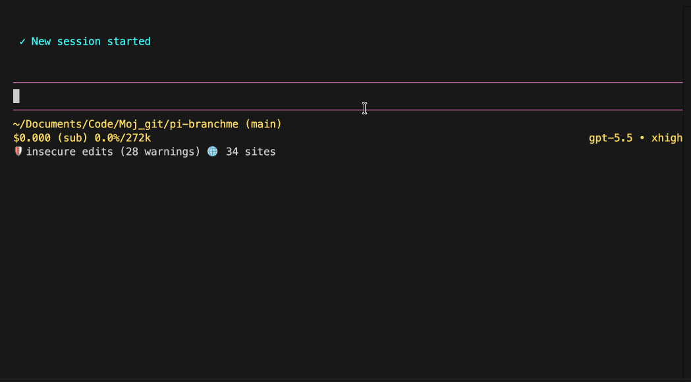

<p align="center">
  
</p>

<p align="center">
  <a href="https://pi.dev"></a>
  <a href="https://www.npmjs.com/package/@senad-d/branchme"></a>
  <a href="LICENSE"></a>
</p>

<p align="center">
  Current-repository branch and PR automation for <a href="https://pi.dev">pi</a>.
  <br />Create a branch, push the current branch, and open a GitHub pull request from agent tools.
</p>

---

BranchMe is a Pi extension project for focused git branch workflows. It is prepared to add tools that inspect the current repository, create a branch from `HEAD`, publish the current branch, and create a GitHub pull request without leaving pi.

> **Implementation status:** feature implementation is pending. The repository identity, docs, specs, and non-functional stubs are prepared; the planned `/branchme` command and BranchMe tools are not implemented yet.

<table align="center">
  <tr>
    <th>BranchMe demo</th>
  </tr>
  <tr>
    <td align="center">
      
    </td>
  </tr>
</table>

- **Current-repo only:** PR creation is planned to infer owner/repo from the checkout, not from tool arguments.
- **Automation-friendly:** GitHub auth is planned through `GITHUB_TOKEN` or `GH_TOKEN`, including GitHub Actions.
- **No commits:** BranchMe intentionally does not stage files, create commits, or generate commit messages.
- **Pi-native:** planned `/branchme` help/config UI plus agent-callable tools.

> **Security:** pi packages run with your full system permissions. BranchMe is planned to run local `git` commands, push the current branch, call the GitHub REST API, and read `GITHUB_TOKEN` or `GH_TOKEN` from the process environment. BranchMe is not planned to edit files, create commits, read `.env`, or send telemetry. Read [`SECURITY.md`](SECURITY.md).

## Table of Contents

- [Quick Start](#quick-start)
- [Installation](#installation)
- [Planned Workflow](#planned-workflow)
- [Commands](#commands)
- [Agent Tools](#agent-tools)
- [GitHub Authentication](#github-authentication)
- [Current Repository Boundary](#current-repository-boundary)
- [Troubleshooting](#troubleshooting)
- [Implementation Specs](#implementation-specs)
- [Update and Uninstall](#update-and-uninstall)
- [Development](#development)
- [Publishing](#publishing)
- [License](#license)

---

## Quick Start

From this source checkout while implementation is pending:

```bash
npm install
npm run validate
pi --no-extensions -e .
```

After BranchMe is implemented and published, the planned install path is:

```bash
pi install npm:@senad-d/branchme
cd /path/to/your/git/repo
pi
```

Planned first commands inside pi:

```text
/branchme
/branchme help
```

Branch actions will be performed through tools, not slash commands.

---

## Installation

| Scope | Command | Notes |
| --- | --- | --- |
| Global | `pi install npm:@senad-d/branchme` | Planned package install after release. |
| Project-local | `pi install npm:@senad-d/branchme -l` | Planned `.pi/settings.json` project install after release. |
| One run | `pi -e npm:@senad-d/branchme` | Planned try-without-install mode after release. |
| Git | `pi install git:github.com/senad-d/branchme@<tag>` | Pin a tag or commit. |
| Local checkout | `pi --no-extensions -e .` | Develop or test this repository in isolation. |

Source checkout:

```bash
git clone https://github.com/senad-d/branchme.git
cd branchme
npm install
npm run validate
pi --no-extensions -e .
```

Use the checkout globally while developing:

```bash
pi install /absolute/path/to/branchme
```

---

## Planned Workflow

BranchMe is designed to complement CommitMe or your normal git commit workflow:

1. Use `branch_status` to inspect the current branch and repository state.
2. Use `create_branch` with an explicit `branchName` to create and checkout a branch from current `HEAD`.
3. Create commits outside BranchMe.
4. Use `push_branch` to push the current branch, publishing it to `origin` if it has no upstream.
5. Use `pull_request` with explicit PR fields to open a GitHub pull request.

BranchMe intentionally avoids commit functionality because CommitMe already handles staging and commit-message creation.

---

## Commands

| Command | Status | Description |
| --- | --- | --- |
| `/branchme` | Planned | Open a simple TUI config/status/help panel. No git or GitHub actions. |
| `/branchme help` | Planned | Show workflow notes. `/branchme --help` and `/branchme -h` should also work. |

Slash commands are informational only. Tools perform all branch, push, and PR actions.

---

## Agent Tools

| Tool | Status | Planned schema | Behavior |
| --- | --- | --- | --- |
| `branch_status` | Planned | `{}` | Read current repo, branch, upstream, dirty state, ahead/behind state, and GitHub repo info. |
| `create_branch` | Planned | `{ branchName }` | Create and checkout `branchName` from current `HEAD`. |
| `push_branch` | Planned | `{}` | Push the current branch; use `origin` and set upstream when needed. |
| `pull_request` | Planned | `{ headBranch, baseBranch, title, body, draft }` | Create a PR in the current GitHub repository via REST API. |

All PR inputs are planned to be required. `pull_request` will not accept `owner` or `repo`; BranchMe must infer the repository from the current checkout and/or matching `GITHUB_REPOSITORY`.

---

## GitHub Authentication

`pull_request` is planned to use process environment tokens only:

- `GITHUB_TOKEN`
- `GH_TOKEN`

This keeps the tool usable in GitHub Actions and other automation. BranchMe is not planned to depend on GitHub CLI or read `.env` in v1.

GitHub Actions example:

```yaml
env:
  GITHUB_TOKEN: ${{ secrets.GITHUB_TOKEN }}
```

---

## Current Repository Boundary

BranchMe is planned to operate only on the git repository where pi is running.

- `create_branch` creates from current `HEAD` only.
- `push_branch` pushes the current branch only.
- `pull_request` creates PRs for the resolved current GitHub repository only.
- If local git metadata and `GITHUB_REPOSITORY` disagree, the implementation should fail closed.

---

## Troubleshooting

| Problem | Try |
| --- | --- |
| Tool says not a git repository | Start pi from inside a git checkout. |
| PR auth fails | Set `GITHUB_TOKEN` or `GH_TOKEN` in the process environment. |
| Repository cannot be resolved | Ensure `origin` points to GitHub or set matching `GITHUB_REPOSITORY=owner/repo`. |
| Push fails without upstream | `push_branch` is planned to publish the current branch to `origin`; check remote permissions. |
| Need a commit | Use CommitMe or normal git commands before `push_branch`; BranchMe does not commit. |
| Other extensions interfere | Test with `pi --no-extensions -e .`. |

---

## Implementation Specs

Read these before implementing features:

- [`docs/PROJECT_DEFINITION_BRIEF.md`](docs/PROJECT_DEFINITION_BRIEF.md)
- [`specs/spec-architecture.md`](specs/spec-architecture.md)
- [`specs/spec-guidelines.md`](specs/spec-guidelines.md)
- [`specs/spec-tasks.md`](specs/spec-tasks.md)

The task spec checkboxes must stay unchecked until a later implementation session completes and validates each task.

---

## Update and Uninstall

After package release:

```bash
pi update --extensions
pi update npm:@senad-d/branchme
pi remove npm:@senad-d/branchme
pi remove npm:@senad-d/branchme -l
```

---

## Development

```bash
npm install
npm run typecheck
npm run lint
npm run format:check
npm run validate
```

Useful local smoke test:

```bash
pi --no-extensions -e .
```

---

## Publishing

BranchMe is planned to publish to npm as `@senad-d/branchme`.

Do not publish until the planned tools and `/branchme` command are implemented, tested, documented, and the changelog is updated.

```bash
npm login
npm whoami
npm run validate
npm version <version>
npm publish --access public
```

Run release commands only from a clean working tree.

## License

MIT
