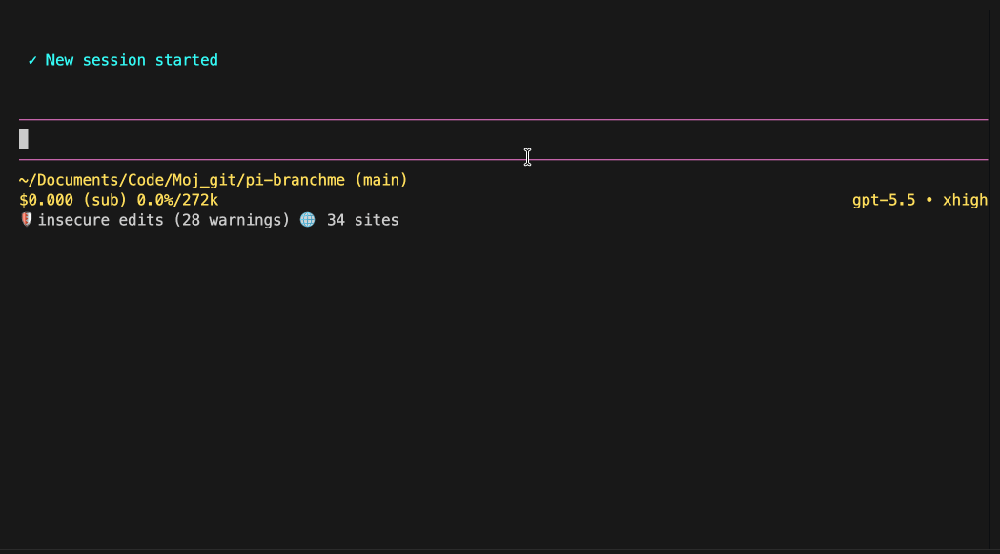

<p align="center">
  
</p>

<p align="center">
  <a href="https://pi.dev"></a>
  <a href="https://www.npmjs.com/package/@senad-d/branchme"></a>
  <a href="LICENSE"></a>
  <a align="center" href="https://sonarcloud.io/summary/new_code?id=senad-d_BranchMe"></a>
</p>

<p align="center">
  Current-repository branch and pull request tools for <a href="https://pi.dev">pi</a>.
  <br />Inspect branch state, fetch, switch/create/pull/rebase branches, push, and open GitHub PRs from pi prompts.
</p>

---

BranchMe is a Pi extension for safe branch workflow automation. Before each agent run, it appends a bounded, read-only snapshot of the current Git repository to the system prompt. It also adds an informational `/branchme` command and eight agent-callable tools that explicitly refresh state, switch to an existing local branch, fetch its configured upstream remote, fast-forward or rebase the clean current branch onto its upstream, create a branch from the current `HEAD`, push the current branch, and create a GitHub pull request.

<table align="center">
  <tr>
    <th>BranchMe demo</th>
  </tr>
  <tr>
    <td align="center">
      
    </td>
  </tr>
</table>

- **Context-aware:** every agent run starts with bounded branch, working-tree, related-PR, and recent-commit metadata; repository metadata is untrusted data, not instructions.
- **Current-repository only:** Git and GitHub operations are scoped to the checkout where pi is running; fetch, pull, and rebase resolve the current branch's configured upstream.
- **Explicit history rewrites:** `rebase_branch` runs only when explicitly requested, requires a clean current branch with an upstream, disables autostash and multi-ref updates, and automatically attempts to abort on failure.
- **Commit-safe:** context collection is read-only, and BranchMe never stages files, creates user-authored commits, generates commit messages, force-pushes, creates merge commits, resets, or edits files directly.
- **Strict tools:** tool schemas reject extra properties such as `force`, `stash`, `discard`, `owner`, `repo`, `path`, or `baseRef`.
- **PR-ready:** create GitHub pull requests from existing local branches after verifying the `headBranch` matches GitHub and the base is visible, with explicit PR fields and `GITHUB_TOKEN` or `GH_TOKEN` from the process environment or a local `.env` fallback.

> **Security:** pi packages run with your full system permissions. BranchMe runs local `git` commands, may make an automatic authenticated GitHub request to find a related open pull request, can fetch remotes, switch/create/pull/rebase branches, push the current branch, and create GitHub pull requests. Read [`SECURITY.md`](SECURITY.md).

## Table of Contents

- [Quick Start](#quick-start)
- [Installation](#installation)
- [Repository and GitHub Setup](#repository-and-github-setup)
- [Configuration](#configuration)
- [Commands](#commands)
- [Tools](#tools)
- [Workflow and Boundaries](#workflow-and-boundaries)
- [GitHub Actions](#github-actions)
- [Troubleshooting](#troubleshooting)
- [Diagnostics](#diagnostics)
- [Update and Uninstall](#update-and-uninstall)
- [Development](#development)
- [Publishing](#publishing)
- [License](#license)

---

## Quick Start

```bash
pi install npm:@senad-d/branchme
cd /path/to/your/git/repo
pi
```

Inside pi:

```text
/branchme
/branchme help
```

A normal prompt can use the automatic start-of-run snapshot without a tool call. Ask for an explicit refresh when needed, for example:

```text
Refresh the repository state with branch_status, then create a branch named feature/update-docs with create_branch.
```

A typical BranchMe flow is:

1. Use the automatic snapshot to understand state at the start of the agent run.
2. Use `branch_status` when you explicitly need fresh state, especially after a Git mutation in the same run.
3. Switch to the local base branch with `change_branch`.
4. Update it from its configured upstream with `pull_branch`, which requires a clean worktree and uses fast-forward-only semantics.
5. Create from the updated `HEAD` with `create_branch`.
6. Make edits and commit outside BranchMe.
7. Push the current branch with `push_branch`.
8. After `push_branch` completes and GitHub can see the branches, create a pull request with `pull_request`.

To refresh the current branch's configured remote-tracking ref without changing the local branch or working tree, use `fetch_branch`. To reconcile the clean current branch by rewriting its local commits, run `fetch_branch`, wait for it to complete, and then run `rebase_branch`. Both tools require a configured upstream; `rebase_branch` automatically attempts `git rebase --abort` if rebasing fails.

BranchMe is tool-based. The slash command is informational only and never changes or updates branches, fetches, rebases, pushes, commits, stages, edits files, or opens pull requests.

---

## Installation

| Scope | Command | Notes |
| --- | --- | --- |
| Global | `pi install npm:@senad-d/branchme` | Loads in every trusted pi project. |
| Project-local | `pi install npm:@senad-d/branchme -l` | Writes to `.pi/settings.json` in the current project. |
| One run | `pi -e npm:@senad-d/branchme` | Try without changing settings. |
| Git | `pi install git:github.com/senad-d/branchme@<tag>` | Pin a tag or commit. |
| Local checkout | `pi --no-extensions -e .` | Develop or test this repository in isolation. |

Once loaded, BranchMe collects automatic Git context before each agent run. This happens for ordinary prompts; there is no `/branchme context` command and no additional tool to enable it.

Source checkout:

```bash
git clone https://github.com/senad-d/branchme.git
cd branchme
npm install --ignore-scripts
npm run validate
pi --no-extensions -e .
```

Use the checkout globally while developing:

```bash
pi install /absolute/path/to/branchme
```

---

## Repository and GitHub Setup

BranchMe does not bundle Git and does not create repositories. Start pi from inside the repository you want BranchMe to manage:

```bash
cd /path/to/your/git/repo
git status
git remote get-url origin
pi
```

For pull requests, the repository must resolve to GitHub from local `origin` and/or `GITHUB_REPOSITORY`:

```bash
git remote set-url origin git@github.com:OWNER/REPO.git
# or
export GITHUB_REPOSITORY=OWNER/REPO
```

For automatic related-PR lookup and `pull_request`, set a token in the process environment before starting pi:

```bash
export GITHUB_TOKEN=github_pat_...
# or
export GH_TOKEN=ghp_...
pi
```

Or copy `.env.example` to `.env` in the repository root and fill in one token value:

```bash
cp .env.example .env
$EDITOR .env
pi
```

`fetch_branch`, `pull_branch`, and `push_branch` use your normal Git remote credentials. BranchMe does not inject `GITHUB_TOKEN` into `git fetch`, `git pull`, or `git push`. `rebase_branch` operates on the locally available configured upstream ref and makes no network request itself.
When the current branch already has an upstream, BranchMe pushes an explicit `HEAD:<upstream-branch-ref>` refspec to the configured upstream remote instead of relying on a bare `git push`.
Run `pull_request` only after `push_branch` has completed; `pull_request` preflights the GitHub `headBranch` and `baseBranch` before creating the PR and fails with retry guidance if a branch is not visible yet or the GitHub `headBranch` commit does not match the local branch.

---

## Configuration

BranchMe has no project config file. It reads process environment variables for automatic related-PR lookup, GitHub pull request creation, and optional repository boundary checks, with a local `.env` token fallback when no process token is set. Token lookup checks `process.env.GITHUB_TOKEN`, then `process.env.GH_TOKEN`; if neither is set, BranchMe reads `.env` from the verified git root and checks `GITHUB_TOKEN`, then `GH_TOKEN`.

| Variable | Meaning |
| --- | --- |
| `GITHUB_TOKEN` | Preferred token for automatic related-PR lookup and `pull_request`; process environment first, then local `.env` fallback. |
| `GH_TOKEN` | Fallback token for automatic related-PR lookup and `pull_request`; process environment first, then local `.env` fallback. |
| `GITHUB_REPOSITORY=owner/repo` | Optional CI fallback and boundary check for the current GitHub repository; process environment only. |

BranchMe reads only `GITHUB_TOKEN` and `GH_TOKEN` from a small regular `.env` file; it rejects directories, symlinks, special files, and oversized files. BranchMe does not import other `.env` keys, read shell profiles, GitHub CLI credentials, or local credential stores. Token values are redacted from automatic context, errors, tool content, and tool details.

If local `origin` and `GITHUB_REPOSITORY` both resolve but disagree, `pull_request` fails closed.

---

## Commands

| Command | Description |
| --- | --- |
| `/branchme` | Show a compact status panel or fallback message with current branch, GitHub repository resolution, token presence, and workflow notes. |
| `/branchme help` | Show concise BranchMe workflow help and runtime requirements. |
| `/branchme --help` | Alias for `/branchme help`. |
| `/branchme -h` | Alias for `/branchme help`. |

Commands are informational only. BranchMe actions are performed by agent-callable tools. `/branchme` uses the TUI panel in TUI mode, notifications in RPC mode, plain text only in print mode, and stays stdout-silent in JSON mode to avoid corrupting protocol output. Unsupported non-empty `/branchme` arguments return guidance to use `/branchme help` where the current mode can display it safely.

---

## Tools

| Tool | Schema | Behavior |
| --- | --- | --- |
| `branch_status` | `{}` | Explicitly refreshes the same bounded context used at agent start: repo root in structured details, branch/detached state, upstream and ahead/behind counts, working-tree counts and unstaged/untracked paths, related open PR, and recent commits. It is read-only. |
| `change_branch` | `{ "branchName": string }` | Validates `branchName`, requires `refs/heads/<branchName>` to exist locally, rejects dirty worktrees, and runs `git switch <branchName>`. |
| `fetch_branch` | `{}` | Requires a current branch with a configured upstream and runs `git fetch --no-tags --no-recurse-submodules <upstream-remote> <upstream-branch-ref>:<remote-tracking-ref>`; only that tracking ref is refreshed without changing local branches or working-tree files. |
| `pull_branch` | `{}` | Requires a clean current branch with a configured upstream and runs `git pull --ff-only --no-rebase --no-autostash <upstream-remote> <upstream-branch-ref>`; divergence fails without rebasing or creating a merge commit. |
| `rebase_branch` | `{}` | Requires a clean current branch with a configured upstream and runs `git rebase --no-autostash --no-update-refs <upstream>`; it rewrites local commits and automatically attempts `git rebase --abort` on failure. |
| `create_branch` | `{ "branchName": string }` | Validates `branchName`, rejects existing local branches, and runs `git switch -c <branchName>` from current `HEAD`. |
| `push_branch` | `{}` | Pushes the current branch to its configured upstream remote with an explicit `HEAD:<upstream-branch-ref>` refspec, or publishes it with `git push --set-upstream origin <currentBranch>` when no upstream exists. |
| `pull_request` | `{ "headBranch": string, "baseBranch": string, "title": string, "body": string, "draft": boolean }` | Preflights GitHub branch visibility and verifies the GitHub `headBranch` commit matches the local branch, then creates a pull request in the resolved current repository via `POST /repos/{owner}/{repo}/pulls`; branch refs must exist locally and cannot use `owner:branch`. |

All schemas reject additional properties. `change_branch` never accepts `baseRef`, `force`, `stash`, `discard`, `create`, `owner`, `repo`, or path inputs. `fetch_branch`, `pull_branch`, and `rebase_branch` have strict empty schemas and never accept a branch, remote, refspec, force, autostash, or arbitrary rebase target. `pull_request` never accepts `owner`, `repo`, or owner-prefixed branch refs; BranchMe resolves the repository from local `origin` and/or matching `GITHUB_REPOSITORY`.

---

## Workflow and Boundaries

### Automatic context and freshness

Before each agent run, BranchMe appends an **Automatic Git Context** snapshot to the existing system prompt. The snapshot contains these fields in order:

- current branch or detached `HEAD`, plus upstream and ahead/behind counts when available;
- working-tree state and staged, unstaged, and untracked counts;
- up to 20 unstaged or untracked change entries with Git status, path, and original path for renames/copies;
- related open PR status and, when found, its number, title, repository, head/base branches, URL, state, and draft flag;
- up to 5 recent commits with short hash, date, and subject.

Collection defaults are a 5-second timeout per local Git command, a 4-second related-PR lookup timeout, at most 512 characters per metadata value, and at most 4,000 characters for the rendered snapshot. GitHub response bodies are limited to 64 KiB. The formatter can further shorten values or omit entries to stay within the total limit.

The snapshot is fresh at agent start but is not live. A fetch, branch switch, pull, rebase, commit, file change, push, or other mutation later in the same run can make it stale. `branch_status` performs an explicit current-state refresh through the same shared collector and remains read-only; it does not mutate files, Git state, or GitHub state.

Related-PR metadata does not come from Git alone. When repository, branch, and credentials resolve, automatic collection and explicit `branch_status` may make an authenticated `GET /repos/{owner}/{repo}/pulls?state=open&head={owner}:{branch}&per_page=1` request. Without a token there is no unauthenticated fallback or GitHub request; the PR field is reported as unavailable while local Git context remains usable.

Repository paths, commit subjects, branch names, and PR titles are treated as untrusted metadata. BranchMe redacts token values, escapes control characters, quotes and bounds values before prompt insertion, and never captures diffs or file contents. Staged files contribute only to the staged count; the path list is limited to unstaged and untracked entries.

Use BranchMe from pi prompts or automation that drives pi with explicit tool calls:

```text
Use branch_status.
Switch to the base branch with change_branch, then use pull_branch after the switch completes.
Fetch the current branch upstream with fetch_branch, wait for it to complete, then rebase with rebase_branch.
Create branch feature/docs-refresh from the updated current HEAD with create_branch.
Push the current branch with push_branch.
After push_branch completes, create a draft pull request from feature/docs-refresh to main titled "Refresh docs" with this body: "...".
```

BranchMe operates only on the repository where pi is running:

- Automatic collection and `branch_status` run bounded, read-only Git commands from the verified git root.
- Git commands use `pi.exec("git", args, { cwd, signal, timeout })` with argv arrays; repository mutations run from the verified git root.
- `change_branch` switches only to existing local branches and has no `force`, `stash`, `discard`, remote, or path input.
- `fetch_branch` requires a configured upstream, uses an explicit source-to-remote-tracking refspec with tags and submodule recursion disabled, and does not change local branches or working-tree files.
- `pull_branch` requires a clean worktree and configured upstream, updates only the current branch with `git pull --ff-only --no-rebase --no-autostash`, and has no branch, remote, force, or rebase input.
- `rebase_branch` requires a clean worktree and configured upstream, rewrites only the current branch onto the locally available upstream with autostash and multi-ref updates disabled, and automatically attempts to abort on failure.
- `create_branch` creates from the current `HEAD` only and has no `baseRef` input.
- `push_branch` pushes only the current branch, uses no bare upstream `git push`, and has no `branchName` input.
- `pull_request` creates PRs only for the resolved current GitHub repository, requires `headBranch` and `baseBranch` to exist locally, requires the GitHub `headBranch` commit to match the local branch, queues behind in-flight same-repository git mutation windows when possible, and rejects `owner:branch` head refs.
- If local `origin` and `GITHUB_REPOSITORY` both resolve but disagree, `pull_request` fails closed.

BranchMe intentionally does **not** stage files, create user-authored commits, force checkout, stash changes, discard changes, force-push, create merge commits, edit files directly, or generate commit messages. Rebase-driven commit rewriting occurs only through explicit `rebase_branch` calls.

---

## GitHub Actions

GitHub Actions example:

```yaml
name: branchme-smoke
on:
  workflow_dispatch:

permissions:
  contents: write
  pull-requests: write

jobs:
  branchme:
    runs-on: ubuntu-latest
    env:
      GITHUB_TOKEN: ${{ secrets.GITHUB_TOKEN }}
      GITHUB_REPOSITORY: ${{ github.repository }}
    steps:
      - uses: actions/checkout@v4
        with:
          fetch-depth: 0
      - uses: actions/setup-node@v4
        with:
          node-version: 22
      - run: npm install -g --ignore-scripts @earendil-works/pi-coding-agent
      - run: pi --no-extensions -e npm:@senad-d/branchme --help
```

Ensure the token and Git credentials have permission for the branch and pull request operation you ask BranchMe to perform.

---

## Troubleshooting

| Problem | Try |
| --- | --- |
| Not a git repository | Start pi from inside a git checkout. |
| Detached `HEAD` | Use `change_branch` to switch to an existing local branch, or checkout a branch before `fetch_branch`, `pull_branch`, `rebase_branch`, `create_branch`, or `push_branch`. |
| Branch already exists | Choose a new local branch name for `create_branch`, or use `change_branch` to switch to it. |
| Branch does not exist locally | Create a local branch first; `change_branch` does not checkout remote branches. |
| Dirty worktree before branch switch, pull, or rebase | Commit, stash, or discard changes outside BranchMe before using `change_branch`, `pull_branch`, or `rebase_branch`. |
| Fetch, pull, or rebase has no upstream | Configure the current branch upstream outside BranchMe, then retry the tool. |
| Pull is not a fast-forward | Run `fetch_branch`, wait for it to complete, then explicitly run `rebase_branch` if rewriting local commits is intended; otherwise reconcile outside BranchMe. |
| Rebase fails or conflicts | `rebase_branch` automatically attempts `git rebase --abort`. Inspect repository state before continuing if automatic cleanup also fails. |
| Push fails | Confirm the current branch is correct and your normal Git remote credentials can push. |
| Related PR is unavailable | Set `GITHUB_TOKEN` or `GH_TOKEN` before starting pi if related-PR context is wanted. Without a token, BranchMe keeps local context and intentionally makes no unauthenticated GitHub request. |
| PR auth fails | Set `GITHUB_TOKEN` or `GH_TOKEN` before starting pi, or copy `.env.example` to `.env` and fill in one token. |
| PR branch does not exist locally | Create or fetch/check out the local `headBranch` and `baseBranch` branches first; BranchMe does not use remote-only or cross-repository PR refs. |
| PR branch is not visible or is stale on GitHub | Run `push_branch`, wait for it to complete, then retry `pull_request`; do not batch `push_branch` and `pull_request` in the same assistant tool call. |
| Repository mismatch | Make `origin` and `GITHUB_REPOSITORY` refer to the same `owner/repo`. |
| Need a commit | Use BranchMe or normal git commands; BranchMe never commits. |
| Other extensions interfere | Test with `pi --no-extensions -e .`. |

---

## Diagnostics

From a source checkout:

```bash
npm run validate
npm run check:pack
printf '/branchme help\n/quit\n' | pi --no-extensions -e .
```

Validation covers TypeScript typechecking, formatting checks, automatic context collection and prompt injection, mocked GitHub lookup, unit tests, package checks, checkout Pi runtime smoke, and package-content verification. The checkout smoke loads BranchMe through Pi, then uses a temporary verifier command to confirm all eight BranchMe tools are visible through `pi.getAllTools()` with strict schemas and prompt metadata. Smoke-test notes are recorded in [`docs/SMOKE_TEST.md`](docs/SMOKE_TEST.md), and TUI/help captures are stored in [`docs/TUI_CAPTURE.md`](docs/TUI_CAPTURE.md).

Refresh TUI captures intentionally with:

```bash
UPDATE_TUI_CAPTURE=1 node --test test/tui-capture.test.mjs
```

---

## Update and Uninstall

```bash
pi update --extensions                  # update installed pi packages
pi update npm:@senad-d/branchme        # update BranchMe only
pi remove npm:@senad-d/branchme        # remove global install
pi remove npm:@senad-d/branchme -l     # remove project-local install
```

---

## Development

```bash
npm install
npm run typecheck
npm run format:check
npm run test
npm run check:pack
npm run validate
npm run smoke:pi:packed
pi --no-extensions -e .
```

`npm run check:pack` verifies the npm package does not include local state, specs, caches, `node_modules`, real environment files, or other private development artifacts. The safe `.env.example` template is included.
`npm run smoke:pi` is the checkout runtime smoke and verifies BranchMe command output plus real Pi tool registration metadata.
`npm run smoke:pi:packed` is the release-gate smoke: it packs the npm artifact into a temporary directory, installs it with production dependency settings, and runs pi against the installed package.

---

## Publishing

BranchMe publishes to npm as `@senad-d/branchme`. You need an npm account with publish access to the `@senad-d` scope.

```bash
npm login
npm whoami
npm run release:check # optional preflight; the publish script runs this too
node scripts/publish-npm.mjs
```

The publish script requires a clean working tree, asks for the version number, runs `npm run release:check` (validation plus installed-package smoke), runs `npm version <version>` to update `package.json` and `package-lock.json`, creates the `v<version>` git tag, publishes with `npm publish --access public`, and then offers to push the release commit and tag.

Run it only from a clean working tree after updating `CHANGELOG.md`.

## License

MIT
